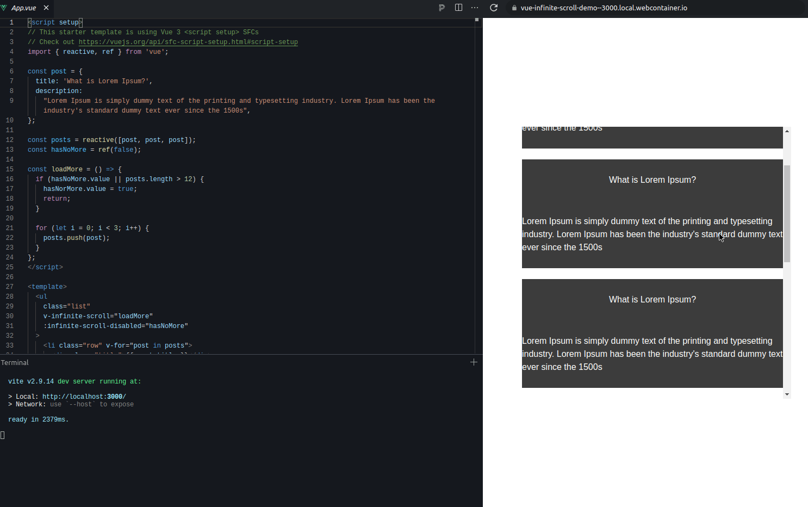

<div align="center">
  
  
  
</div>

<p align="center">
  <a href="https://github.com/kurt-liao/vue-infinite-scroll/issues"> Issue </a>
  .
  <a href="https://github.com/kurt-liao/vue-infinite-scroll/pulls"> Feature </a>
</p>

## Installation

```
npm install @kurtliao/vue-infinite-scroll

or

yarn add @kurtliao/vue-infinite-scroll
```

## Usage


### Demo

[Try it online](https://stackblitz.com/edit/vue-infinite-scroll-demo)



### Import globally
```js

import InfiniteScroll from "@kurtliao/vue-infinite-scroll";

const app = createApp(App);

app.directive("InfiniteScroll", InfiniteScroll);
```

### Simple

```vue

<template>
  <ul class="list" v-infinite-scroll="loadMore">
    <li class="row" v-for="item in items">{{ item }}</li>
  </ul>
</template>

<script setup>

const loadMore = () => {
  // call your api here to load more data
}

</script>

<style>
.list {
  height: 300px;
  overflow: auto;
}

.row {
  height: 200px;
}

</style>

```

### Optional

`infinite-scroll-disabled`

```vue
<template>
  <ul class="list" v-infinite-scroll="loadMore" :infinite-scroll-disabled="hasNoMore">
    <li v-for="item in items">{{ item }}</li>
  </ul>
</template>

<script setup>

const hasNoMore = ref(false)

const loadMore = () => {
  // call your api here to load more data
  ...
  
  // if no more data
  hasNoMore.value = true
}

</script>
```

`infinite-scroll-delay`

```vue
<template>
  <!-- set delay for throttle milliseconds, default is 300ms -->
  <ul class="list" v-infinite-scroll="loadMore" infinite-scroll-delay="1000">
    <li v-for="item in items">{{ item }}</li>
  </ul>
</template>

<script setup>

const loadMore = () => {
  // call your api here to load more data
  ...
}

</script>
```
---

<h3>Contributions welcome! Also ⭐ </h3>
